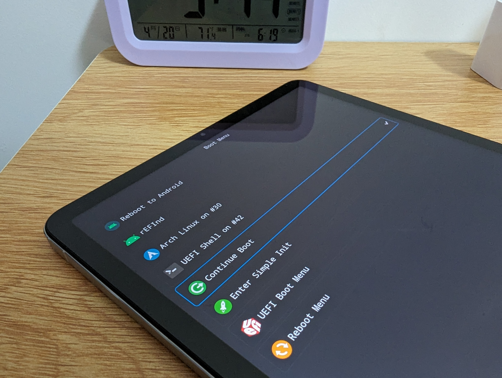

# Enable UEFI on any Linux distributions


### Get the Device Tree config file

In [computing](https://en.wikipedia.org/wiki/Computing), a devicetree (also written device tree) is a [data structure](https://en.wikipedia.org/wiki/Data_structure) describing the hardware components of a particular computer so that the [operating system](https://en.wikipedia.org/wiki/Operating_system)'s [kernel](https://en.wikipedia.org/wiki/Kernel_\(operating_system\)) can use and manage those components, including the [CPU](https://en.wikipedia.org/wiki/Central_processing_unit) or CPUs, the [memory](https://en.wikipedia.org/wiki/Computer_memory), the [buses](https://en.wikipedia.org/wiki/Bus_\(computing\)) and the [integrated peripherals](https://en.wikipedia.org/wiki/Integrated_peripheral).



Device tree is widely used on ARM64 platform when it uses Linux kernel, instead of ACPI. The latter can be found on most x86\_64 based devices.

Systems which use device trees usually pass a static device tree (perhaps stored in [EEPROM](https://en.wikipedia.org/wiki/EEPROM), or stored in NAND device like [eUFS](https://en.wikipedia.org/wiki/EUFS)) to the operating system, but can also generate a device tree in the early stages of [booting](https://en.wikipedia.org/wiki/Booting).&#x20;


On Renegade Project's UEFI firmware, the device tree is used when your device is booting Linux kernel via EFI stub. To get the device tree file, we need to look up it in kernel repository. So open your terminal, and type this command, it will simply download the whole repository and store it on your disk:

```bash
git clone https://github.com/maverickjb/linux-6.1.10.git
```

```bash
git clone https://gitlab.postmarketos.org/panpanpanpan/sm8150-mainline.git
```


**NOTE**: **if you want to use the latest mainline kernel as daily driver:**

* Driver for the PM8150B charger is broken in mainline, the only way to charge your tablet is by simply fixing the In8000\* fast charger driver for mainline. About the patch files, they're [located here](https://file.chyk.ink/Linux/nabu-patches), for fixing the charger, [see below](enable-uefi-on-any-linux-distributions.md#compile-the-linux-kernel);
* Based on my personal tests, microphones are available, but unusable. Because the record volume is **extremely LOUD**, no matter which volume you've selected. If you keep using it (as for now), you will damage your ears and speakers !
* Real time clock (RTC) is working, but a manual patch is required.


Once it finished, go to the repository's directory. We need to find the proper device tree file that ended with file extension name (\*.dts). It is stored under `arch/arm64/boot/dts` . `cd` into this directory, find the DTS file named "`sm8150-xiaomi-nabu.dts`".

Now, let's install some basic tool for compiling the Linux kernel.

On Ubuntu and other Debian-based distributions:

```bash
sudo apt build-dep linux linux-image-unsigned-$(uname -r)
```

Unfortunately, the above does not install all of the necessary dependencies. The current Disco Dingo release requires the following additional packages.&#x20;

* ```bash
  sudo apt install libncurses-dev gawk flex bison openssl libssl-dev dkms libelf-dev libudev-dev libpci-dev libiberty-dev autoconf llvm gcc-aarch64-linux-gnu
  ```

If you are going to be using git, install it via:&#x20;

* ```bash
  sudo apt install git
  ```


This is an Ubuntu-specific hint. For Debian-based distributions, skip readng this.

The above command requires your system to have the correct `deb-src` lines in `/etc/apt/sources.list`. For example, on Disco Dingo you should have:&#x20;

* ```purebasic
  deb-src http://archive.ubuntu.com/ubuntu disco main
  deb-src http://archive.ubuntu.com/ubuntu disco-updates main
  ```


On Arch Linux(and distributions based on it):

Install the [base-devel](https://archlinux.org/packages/?name=base-devel) [meta package](https://wiki.archlinux.org/title/Meta_package), which pulls in necessary packages such as [make](https://archlinux.org/packages/?name=make) and [gcc](https://archlinux.org/packages/?name=gcc). It is also recommended to install the following packages, as listed in the default Arch kernel [PKGBUILD](https://gitlab.archlinux.org/archlinux/packaging/packages/linux/-/blob/main/PKGBUILD): [xmlto](https://archlinux.org/packages/?name=xmlto), [kmod](https://archlinux.org/packages/?name=kmod), [inetutils](https://archlinux.org/packages/?name=inetutils), [bc](https://archlinux.org/packages/?name=bc), [libelf](https://archlinux.org/packages/?name=libelf), [git](https://archlinux.org/packages/?name=git), [cpio](https://archlinux.org/packages/?name=cpio), [perl](https://archlinux.org/packages/?name=perl), [tar](https://archlinux.org/packages/?name=tar), [xz](https://archlinux.org/packages/?name=xz).

```bash
sudo pacman -S base-devel make gcc git gcc-aarch64-linux-gnu
```

Now compile the DTS file into DTB files:

```bash
make ARCH=arm64 CROSS_COMPILE=aarch64-linux-gnu- dtbs
```

You should have the Device tree files now.

### Compile the Linux kernel


Why you need to fix In8000 charger for `nabu` ?

Well, basically, it's a **pun.** You have a tabled powered by a Li-Lon Battery, and we often call them "E-tablet". As for `nabu`, it's an E-tablet, it's a charge-er ! Get it?


Before you start your compilation, you need to patch the kernel for charger and RTC feature.

Navigate to your kernel repository to continue:

```bash
git apply /path/to/rtc.patch        #For RTC.
mv /path/to/ln8000_charger.c drivers/power/supply        #For charger.
```

Simply enter these commands on terminal:


```bash
make ARCH=arm64 CROSS_COMPILE=aarch64-linux-gnu xiaomi_nabu_maverick_defconfig    #For mainline kernel, its make defconfig sm8150.config
make ARCH=arm64 CROSS_COMPILE=aarch64-linux-gnu- Image.gz dtbs
make ARCH=arm64 install INSTALL_PATH=../install/boot
make ARCH=arm64 dtbs_install INSTALL_DTBS_PATH=../install/boot/dtbs

make ARCH=arm64 CROSS_COMPILE=aarch64-linux-gnu- modules
rm -rf ../install/lib/modules/
make ARCH=arm64 modules_install INSTALL_MOD_PATH=../install
```


Notice the Image.gz is the Android kernel image we won't use. After compiling kernel, you will find the two files we need: a sysmap file and the final kernel image(name begin with "vmlinuz"). Copy them to your tablet's EFI directory.

```bash
sudo cp config-6.1.10-nabu System.map-6.1.10-nabu vmlinuz-6.1.10-nabu /boot
```

You should have these files:

```bash
ls
System.map-6.1.10-nabu+    vmlinux-6.1.10-nabu+ initrd.img
```

### Assign an ESP partition​

To modify the partitions on the UFS, we'll need to download a 3rd-party recovery environment called "Orangefox Recovery" Link is here below:



This will start booting recovery image. Once the screen is on, use the terminal to continue processing. We well use `adb shell` command to finish the rest of this guide.&#x20;

we'll need to use the [parted](https://renegade-project.tech/tools/parted.7z) command tools to do this. Now let's open `adb shell` again and start typing `parted` in the terminal.

```bash
parted /dev/block/sda
GNU Parted 3.3
Using /dev/block/sda
Welcome to GNU Parted! Type 'help' to view a list of commands.
(parted)
```

Enter `print` command to list all partitions for `/dev/block/sda` :


If you are using newer recovery like [TWRP](https://sourceforge.net/projects/xiaomi-pad-5/files/TWRP/Android%2014/) or PBRP Recovery, you need to download `parted` and use `adb` command to copy it to internal storage. Run these commands to finish this:

```bash
adb push parted /tmp/
adb shell chmod 755 /tmp/parted
adb shell
```


Then you will see your current partition table with **`userdata` being the last partition**\
Below is an example of output:

```bash
(parted) print
print
Model: SAMSUNG KLUDG4UHDC-B0E1 (scsi)
Disk /dev/block/sda: 126GB
Sector size (logical/physical): 4096B/4096B
Partition Table: gpt
Disk Flags:
Number  Start   End     Size    File system  Name             Flags
 1      24.6kB  32.8kB  8192B                switch
 2      32.8kB  65.5kB  32.8kB               ssd
 3      65.5kB  98.3kB  32.8kB               dbg
 4      98.3kB  131kB   32.8kB               bk01
 5      131kB   262kB   131kB                bk02
 6      262kB   524kB   262kB                bk03
 7      524kB   1049kB  524kB                bk04
 8      1049kB  1573kB  524kB                keystore
 9      1573kB  2097kB  524kB                frp
10      2097kB  4194kB  2097kB               countrycode
11      4194kB  8389kB  4194kB               misc
12      8389kB  12.6MB  4194kB               vm-data
13      12.6MB  16.8MB  4194kB               bk06
14      16.8MB  25.2MB  8389kB               logfs
15      25.2MB  33.6MB  8389kB               ffu
16      33.6MB  50.3MB  16.8MB               oops
17      50.3MB  67.1MB  16.8MB               devinfo
18      67.1MB  83.9MB  16.8MB               oem_misc1
19      83.9MB  101MB   16.8MB  ext4         metadata
20      101MB   134MB   32.9MB               bk08
21      134MB   168MB   34.2MB               splash
22      168MB   201MB   33.6MB               bk09
23      201MB   9328MB  9127MB               super
24      9328MB  9328MB  131kB                vbmeta_system_a
25      9328MB  9328MB  131kB                vbmeta_system_b
26      9328MB  9396MB  67.1MB               logdump
27      9396MB  9530MB  134MB                minidump
28      9530MB  9664MB  134MB                rawdump
29      9664MB  10.7GB  1074MB  ext4         cust
30      10.7GB  10.9GB  134MB   ext4         rescue
31      10.9GB  126GB   115GB                userdata
```

Now let’s continue partitioning:\
Here the size of `userdata` can be decided by yourself.

Delete partition 31 and again make sure it is not deleted incorrectly.

```bash
(parted) rm 31
rm 31
```

```bash
mkpart esp fat32 50.0GB 51GB
mkfs.fat -F32 -s1 /dev/block/sda32
set 32 esp on
mkpart ubuntu   51GB 100GB
```

Do `sgdisk --resize-table 64 /dev/block/sda` if you need to extend the number of partitions from 32 to 64.

#### Mount EFI partition on Ubuntu

First, check the UUID of your partition:

```bash
[[zhongli@mipad5 ~]$ sudo blkid /dev/sda31
/dev/sda31: LABEL_FATBOOT="ESPNABU" LABEL="ESPNABU" UUID="EE48-EE55" BLOCK_SIZE="4096" TYPE="vfat" PARTL
ABEL="esp" PARTUUID="27aedc83-2799-44fd-a50a-247667540570"
[[zhongli@mipad5 ~1$ sudo blkid /dev/sda33
/dev/sda33: UUID="9260d19d-ffb8-448d-90d7-0bc5bde4e0b7" BLOCK_SIZE="4096" TYPE="ext4" PARTLABEL="arch" P
ARTUUID="15a5fe14-5057-40d1-a894-91a8aa2d57cb"
```

Modify fstab to use these UUIDs above:

```
cat /etc/fstab
# UNCONFIGURED FSTAB FOR BASE SYSTEM
UUID=9260d19d-ffb8-448d-90d7-0bc5bde4e0b7 /               ext4    errors=remount-ro 0       1
UUID=EE48-EE55  /boot/efi       vfat    umask=0077      0
```

### Compile UEFI firmware

We will use Renegade Project EFI firmware for example. Clone the repository to your disk:

```
git clone --recursive git@github.com:edk2-porting/edk2-msm.git
```

Replace the dtb file "`sm8150-xiaomi-nabu.dtb`" in "`edk2-msm/Platform/Xiaomi/sm8150/FdtBlob/nabu/`" with the kernel DTB file "`sm8150-xiaomi-nabu.dtb`" which you used in arm ubuntu. rename to "`sm8150-xiaomi-nabu.dtb`"  and build image:

```bash
./build.sh -d nabu
```

You will receive a boot image. Flash it to `boot` partition:

```
fastboot flash boot /path/to/image
```

Then, install GRUB onto your disk in your Linux distributions:

For Ubuntu and other Debian-based distributions:

```bash
sudo apt install grub-efi grub2-common efibootmgr
sudo grub-install --target=arm64-efi --boot-directory=/boot
sudo grub-mkconfig -o /boot/grub/grub.cfg
```

For Arch Linux and Arch-based:

```bash
sudo pacman -S grub efibootmgr
sudo grub-install --target=arm64-efi --boot-directory=/boot
sudo grub-mkconfig -o /boot/grub/grub.cfg
```

For Alpine and Alpine-based:

```bash
sudo apk add grub grub-efi efibootmgr
sudo grub-install --target=arm64-efi --boot-directory=/boot
sudo grub-mkconfig -o /boot/grub/grub.cfg
```

### Ubuntu specifics

#### Install GRUB on Ubuntu​



On recent Ubuntu images, these steps are no longer needed.


Install GRUB tools and generate RAM disk：

```bash
sudo apt-get install grub2-common grub-efi
sudo grub-install --target=arm64-efi --boot-directory=/boot
```

```bash
sudo apt install initramfs-tools
mkinitramfs -o /boot/initrd.img 6.1.10-nabu
```

Generate GRUB configuration file:

```bash
sudo grub-mkconfig -o /boot/grub/grub.cfg
```

After compiling the kernel and ensuring that the necessary files are moved to your tablet's EFI directory, reboot your device. During the booting process, access the boot menu. This may vary depending on your device, but typically involves pressing one of the function keys (e.g., F12, F9, or F2) right after powering on the device. From the boot menu, select "Ubuntu" .You'll see the GRUB boot menu, use `Vol+` or `Vol-` keys to navigate, `power` button to confirm.

<figure><figcaption><p>Boot menu.</p></figcaption></figure>

### Updating Kernel Parameters (Optional)

If you need to tweak kernel parameters for optimization or compatibility reasons, you can edit the grub configuration file. This file is usually found at `/etc/default/grub`. You would add your parameters to the `GRUB_CMDLINE_LINUX_DEFAULT` line. After editing, apply the changes with `sudo update-grub` and reboot for them to take effect.

Remember, keeping a backup of the original configuration files before making any changes is always a good practice. This precaution ensures you can revert to a working state in case anything goes wrong.

